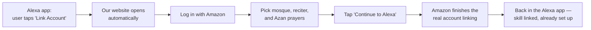
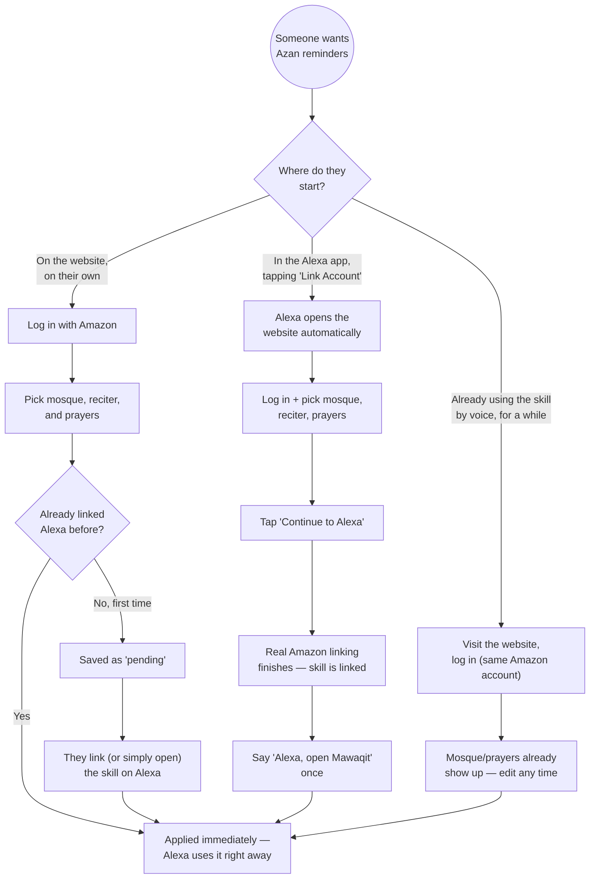

# MAWAQIT Companion Website

This is the website version of the MAWAQIT Alexa skill's setup. Instead of
telling Alexa by voice which mosque to use and which prayers should trigger
the Azan (adhan) reminder, a user can do the same thing here — search for
their mosque, pick a favorite reciter, and tick which prayers should play
the Azan on their Alexa devices.

This document explains, in plain terms:

- [What's actually in this folder](#whats-actually-in-this-folder)
- [How a mosque picked here ends up on someone's Alexa device](#how-a-mosque-picked-here-ends-up-on-someones-alexa-device)
- [What "AlexaLink" means](#what-alexalink-means)
- [How the three kinds of users experience this](#how-the-three-kinds-of-users-experience-this)
- [Running it on your own machine](#running-it-on-your-own-machine)
- [How this gets hosted for real users](#how-this-gets-hosted-for-real-users)
- [Current status / known gaps](#current-status--known-gaps)

If you just want to run the thing locally, skip to
[Running it on your own machine](#running-it-on-your-own-machine).

## What's actually in this folder

This is a small React website (built with [Vite](https://vite.dev)). It's
one piece of a bigger project — the full MAWAQIT Alexa skill lives one
folder up, in `../lambda`. This website doesn't do anything on its own; it
talks to an API that already exists in `../lambda` (a file called
`webApi.js` and its `handlers/web*.js` files), which reads and writes the
exact same database the Alexa skill itself uses.

In other words: **this website and the Alexa skill are two front doors to
the same house.** Whether someone sets their mosque by talking to Alexa or
by clicking around on this website, they end up changing the same record.

```
web/src/
├── pages/
│   ├── Landing.tsx        the "Login with Amazon" screen
│   └── Dashboard.tsx      shows current setup, or the setup wizard if nothing's picked yet
├── components/
│   ├── SetupWizard.tsx    the step-by-step flow: mosque → reciter → prayers
│   ├── MosqueSearch.tsx   search-by-name / search-near-me
│   ├── ReciterSelector.tsx, PrayerSelector.tsx
│   ├── AlexaLinkBanner.tsx   the "Continue to Alexa" banner (see AlexaLink below)
│   └── LinkStatusBanner.tsx  "your Alexa skill is linked" / "not linked yet" message
└── api/client.ts          every call this website makes to the backend goes through here
```

## How a mosque picked here ends up on someone's Alexa device

Two things have to line up for this website to be useful at all:

1. **We need to know it's the same person.** Both the website and the Alexa
   skill use "Login with Amazon" (LWA) — Amazon's own sign-in system. When
   someone logs into this website, Amazon gives us back an account ID.
   That's the same ID Amazon gives the skill when someone links their Alexa
   account. As long as it's the same Amazon account, both sides agree on
   who this is — nothing MAWAQIT-specific has to be invented.

2. **We need to know it's the same record.** The Alexa skill's database
   keeps one row per person, keyed by an Alexa-specific ID. This website
   only ever has the *Amazon account ID* (not the Alexa-specific one),
   because the wizard on this site can run before someone has ever linked
   Alexa at all. So the backend keeps a *second*, small table
   (`azan-users-data`) keyed by the Amazon account ID, and uses it to
   temporarily hold a "pending" mosque/reciter/prayer selection — a
   selection that hasn't been matched up to an Alexa record yet.

That "pending" idea is the key to the whole thing. There are two moments
where a pending selection gets applied to the real Alexa record:

- **Right away**, if the person already has Alexa linked when they save on
  the website.
- **The next time they open or link the skill**, if they don't — the skill
  checks for a pending web selection the first time it hears from that
  person and applies it automatically, instead of asking them to pick a
  mosque by voice.

Nothing about *how the Azan actually plays* changes because of any of this
— that part of the skill (the scheduled reminder, the actual audio trigger)
was already there and keeps working exactly as it did before this website
existed.

## What "AlexaLink" means

"AlexaLink" refers to the small piece of backend code
(`lambda/handlers/webAlexaLinkHandler.js`) and the matching frontend piece
(`AlexaLinkBanner.tsx`) that let someone reach this website **directly from
the Alexa app**, instead of only being able to reach it by typing the
website's address into a browser.

Alexa apps have a standard button for this already — "Link Account" — that
every skill with account linking gets for free. Normally, tapping it just
sends the user straight to Amazon's login page and back; the user never
sees anything MAWAQIT-specific, and there'd be no way to also ask them for
a mosque during that step.

We changed one setting in the skill's configuration (in the Alexa developer
console, and now tracked as code in `.ask/account-linking.json` — see
[Current status](#current-status--known-gaps)) so that tapping "Link
Account" opens **our website** first, instead of going straight to Amazon.
Once someone's done here, a "Continue to Alexa" button sends them back into
the *real*, official Amazon account-linking process to finish up — we're
not replacing that process, just inserting our own setup screen in front of
it.



Why go to the trouble of "handing back" to Amazon instead of just finishing
things ourselves? Because the skill's Azan-playing feature depends on a
security token that only Amazon can issue during that official process —
building our own version of that step would risk breaking the one thing
that actually plays the Azan sound. So this website only ever adds a setup
screen in front of Amazon's own process; it never replaces it.

## How the three kinds of users experience this



A few things worth calling out from that diagram:

- **A brand-new user linking through Alexa still needs one voice
  interaction** ("Alexa, open Mawaqit", or asking it anything) before their
  website selection actually takes effect — see the "pending" explanation
  above. This is easy to miss during testing and looks like a bug if you
  don't know about it.
- **The website only ever recognizes someone by their Amazon account.** If
  you test account linking with one Amazon account and then separately log
  into the website with a different one, the website will correctly show
  "nothing configured" — that's not a bug, it's a different person as far
  as the system is concerned.

## Running it on your own machine

You need two things running at once: the backend (in `../lambda`) and this
website. They're separate processes.

**1. Backend** — from the repo root:

```bash
pnpm --filter ./lambda run serve
```

This starts a small local server (on `http://localhost:3000`) that mimics
what the real, deployed backend does. It still talks to the *real* MAWAQIT
AWS database — it's only the web server part that's local, not the data —
so you'll need AWS credentials active in that terminal (the same ones used
for the rest of this project; ask a teammate if you don't have them yet).

**2. Website** — in a second terminal, from the repo root:

```bash
pnpm --filter ./web run dev
```

This starts the website on `http://localhost:5173`. Open that in a
browser. `web/.env` already points it at `http://localhost:3000` (the
backend from step 1), so no extra setup is needed for local testing.

**3. Try it out** — logging in, searching for a mosque, picking a reciter,
and choosing prayers all work fully locally this way, exactly like a real
user would experience the standalone website.

**One thing that can't be tested purely locally**: the "tap Link Account in
the Alexa app" flow described above ([AlexaLink](#what-alexalink-means))
requires the Alexa app to reach the website over the real internet — a
phone can't open `http://localhost:5173`. Testing that specific flow
end-to-end needs the website actually deployed somewhere reachable — see
the next section.

## How this gets hosted for real users

Three pieces work together, and each is deployed separately:

| Piece | What it is | Where |
|---|---|---|
| Backend API | The same `lambda/webApi.js` mentioned above | An AWS Lambda Function URL — a plain HTTPS address AWS gives a Lambda function directly, no separate API gateway needed |
| Website files | The built version of everything in `web/src` | An S3 bucket (just file storage) |
| Public address | What actually serves the website to a browser | A CloudFront distribution (a CDN) sitting in front of that S3 bucket, giving it a real HTTPS address |

The website (S3 + CloudFront) is deliberately its own deploy, separate from
the backend — the infrastructure for it lives in `../web-infra`, and the
actual build-and-upload step is `../scripts/deploy-web.js`. CloudFront
changes are slow to roll out (15–45 minutes), so keeping it separate from
the backend means a routine backend update never has to wait on that.

Once both are deployed, `web/.env.dev` (or `.env.prod`) is set to the
backend's Function URL address, and that's the only thing tying the two
deploys together — the website doesn't need to know anything about where
it itself is hosted.

## Current status / known gaps

- **The website's public hosting (S3 + CloudFront) hasn't gone live yet.**
  The infrastructure is written (`web-infra/serverless.yml`) but the actual
  deploy is blocked on an AWS permissions request to the platform team.
  Until that's resolved, the backend API is live and working, but the
  website itself has only been run locally and via temporary, throwaway
  public URLs for testing.
- **`.ask/account-linking.json`'s `authorizationUrl` currently points at
  Amazon's own login page**, not at our website's `/oauth/authorize`
  passthrough described above. That file gets pushed to the skill's
  account-linking settings on every deploy (`pnpm push:account-linking-config`),
  so as it stands today, a deploy would silently turn the AlexaLink
  passthrough back off. If AlexaLink should stay on going forward, that
  field needs updating to the backend's Function URL + `/oauth/authorize`.
